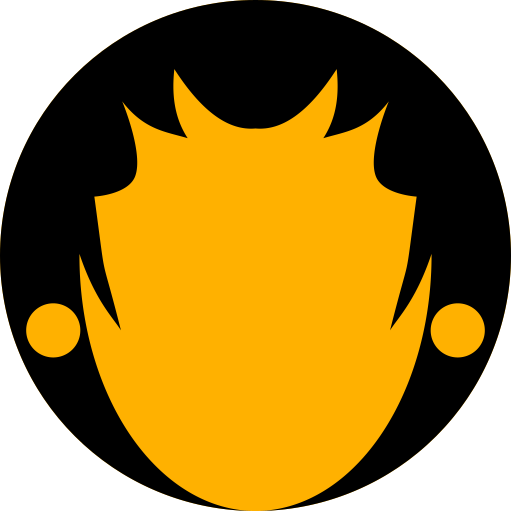

<link href="./assets/styles/markdown.css" rel="stylesheet"></link>
<link href="./assets/styles/color.css" rel="stylesheet"></link>
<link href="./assets/styles/grid.css" rel="stylesheet"></link>

<div><center></center></div>
<div><center></center></div>
<hr class="blue" style="height: 5px; margin-top: 0;">
<div class="blue-text" style="position:relative;text-align:right;">
  <span>
    initialis idea - ide awal
  </span><br>
  <span>
    in profectum - dalam progress
  </span><br>
  
  <span class="accent blue dark-4 white-text">
    dum finitur - sementara dinyatakan selesai
  </span>
</div>
<br><br><br>
<center>

# Favicons
<span class="accent blue dark-4 white-text"><strong>Joko Wandyatmono - last updating Feb 13, 2023</strong></span>

#### /catalyst/02.development/00.paesan/app/docs/02.favicons.md
<hr class="blue" style="height: 5px; margin-bottom: 0;">
</center>
&nbsp;  

Berdasarkan rekomendasi dari The 2022 Guide to <a href="https://www.emergeinteractive.com/insights/detail/The-Essentials-of-FavIcons/" target="_blank">FavIcons for Nearly Everyone and Every Browser</a> yang menyarankan agar memasang 5 ukuran krusial untuk Favicon, dan dengan format `.png`. Tidak perlu `.svg` dan apalagi `.ico`.

<div class="row teal white-text" style="font-size: 1.2em;">
  <div class="col s2">Size</div>
  <div class="col s3">Name</div>
  <div class="col s7">Purpose</div>
</div>
<div class="row grey dark-4" style="font-size: 0.9em;">
  <div class="col s2">32x32</div>
  <div class="col s3">favicon-32.png</div>
  <div class="col s7">Standard for most desktop browsers</div>
</div>
<div class="row grey dark-3" style="font-size: 0.9em;">
  <div class="col s2">96x96</div>
  <div class="col s3">favicon-96.png</div>
  <div class="col s7">Addition. In accordance with experience as a developer so far.</div>
</div>
<div class="row grey dark-4" style="font-size: 0.9em;">
  <div class="col s2">128x128</div>
  <div class="col s3">favicon-128.png</div>
  <div class="col s7">Chrome Web Store icon & Small Windows 8 Star Screen Icon</div>
</div>
<div class="row grey dark-3" style="font-size: 0.9em;">
  <div class="col s2">180x180</div>
  <div class="col s3">favicon-180.png</div>
  <div class="col s7">iOS preferred</div>
</div>
<div class="row grey dark-4" style="font-size: 0.9em;">
  <div class="col s2">192x192</div>
  <div class="col s3">favicon-182.png</div>
  <div class="col s7">Google Developer Web App Manifest Recommendation</div>
</div>

<br><br>

<style>
  .back {
    /* Permalink - use to edit and share this gradient: https://colorzilla.com/gradient-editor/#f0b7a1+0,8c3310+50,752201+51,bf6e4e+100;Brown+Gloss */
    background: #f0b7a1; /* Old browsers */
    background: -moz-linear-gradient(top,  #f0b7a1 0%, #8c3310 50%, #752201 51%, #bf6e4e 100%); /* FF3.6-15 */
    background: -webkit-linear-gradient(top,  #f0b7a1 0%,#8c3310 50%,#752201 51%,#bf6e4e 100%); /* Chrome10-25,Safari5.1-6 */
    background: linear-gradient(to bottom,  #f0b7a1 0%,#8c3310 50%,#752201 51%,#bf6e4e 100%); /* W3C, IE10+, FF16+, Chrome26+, Opera12+, Safari7+ */
    filter: progid:DXImageTransform.Microsoft.gradient( startColorstr='#f0b7a1', endColorstr='#bf6e4e',GradientType=0 ); /* IE6-9 */
    padding: 16px; border-radius: 16px;
  }
</style>
<div class="back">
<div class="row">
  <div class="col s3"></div>
  <div class="col s6" style="text-align: center;">
    
  </div>
  <div class="col s3"></div>
</div>
<div class="row">
  <div class="col s12" style="text-align: center;">
    
    
    
    
    
  </div>
</div>
</div>

<br><br>

Dan berikut ini apa yang disertakan di dalam `<head>` dari `/app/src/app.html`.

<br>

```bash
	<head>
		<meta charset="utf-8" />
		<link rel="icon" type="image/png" sizes="32x32" href="%sveltekit.assets%/images/favicons/favicon-32.png" />
		<link rel="icon" type="image/png" sizes="96x96" href="%sveltekit.assets%/images/favicons/favicon-96.png" />
		<link rel="icon" type="image/png" sizes="128x128" href="%sveltekit.assets%/images/favicons/favicon-128.png" />
		<link rel="icon" type="image/png" sizes="180x180" href="%sveltekit.assets%/images/favicons/favicon-180.png" />
		<link rel="icon" type="image/png" sizes="192x192" href="%sveltekit.assets%/images/favicons/favicon-192.png" />
		<meta name="viewport" content="width=device-width, initial-scale=1.0">
		%sveltekit.head%
	</head>
```
<br>
<div style="text-align: center;">
  
</div>

<hr class="blue" style="height: 5px; margin-bottom: 0;">
<div class="footer blue-text">
  <div style="text-align: center; padding-top: 5px;"><strong>The <span style="font-size: 1.5em;">A</span> Taskforce</strong></div>
  <div class="footer-inner">
    <div class="avatar inline L">
      <svg 
          xmlns="http://www.w3.org/2000/svg" 
          xmlns:xlink="http://www.w3.org/1999/xlink" 
          x="0px" y="0px" width="100%" height="100%"
          position="absolute" top="0px" left="0px"
          viewBox="87.5 87.5 65 73"
          xml:space="preserve"
      >
          <defs>
              <pattern id="profile-0" height="100%" width="100%" patternContentUnits="objectBoundingBox" viewBox="0 0 1 1" preserveAspectRatio="xMidYMid slice">
                <image height="1" width="1"  preserveAspectRatio="xMidYMid slice" xlink:href="../../../../assets/images/profiles/dani.agus.sulistyanto.avif" />
              </pattern> 
          </defs>
          <path fill="url(#profile-0)" d="M122.6,159.883c-1.431,0.822-3.77,0.822-5.201,0l-27.298-15.701c-1.431-0.822-2.601-2.84-2.601-4.483v-31.397 c0-1.647,1.17-3.662,2.601-4.484l27.298-15.7c1.431-0.823,3.77-0.823,5.201,0l27.301,15.7c1.431,0.822,2.6,2.837,2.6,4.484v31.397 c0,1.644-1.169,3.661-2.6,4.483L122.6,159.883z"/>
          <path fill="transparent" stroke="white" stroke-width=".75" d="M146.38,105.483l-23.467-13.498c-0.785-0.452-1.819-0.7-2.912-0.7c-1.094,0-2.128,0.249-2.911,0.7 L93.62,105.483c-1.605,0.922-2.911,3.173-2.911,5.018v26.99c0,1.847,1.306,4.1,2.91,5.024l23.472,13.5 c0.784,0.45,1.817,0.699,2.909,0.699c1.091,0,2.125-0.249,2.913-0.699l23.468-13.5c1.605-0.927,2.912-3.18,2.912-5.024v-26.99 C149.293,108.658,147.985,106.406,146.38,105.483z"/>
      </svg>
    </div>
    <div class="avatar inline L">
      <svg 
          x="0px" y="0px" width="100%" height="100%"
          position="absolute" top="0px" left="0px"
          viewBox="87.5 87.5 65 73"
          xml:space="preserve"
      >
          <defs>
              <pattern id="profile-1" height="100%" width="100%" patternContentUnits="objectBoundingBox" viewBox="0 0 1 1" preserveAspectRatio="xMidYMid slice">
                <image height="1" width="1"  preserveAspectRatio="xMidYMid slice" xlink:href="../../../../assets/images/profiles/emond.suwandi.avif" />
              </pattern> 
          </defs>
          <path fill="url(#profile-1)" d="M122.6,159.883c-1.431,0.822-3.77,0.822-5.201,0l-27.298-15.701c-1.431-0.822-2.601-2.84-2.601-4.483v-31.397 c0-1.647,1.17-3.662,2.601-4.484l27.298-15.7c1.431-0.823,3.77-0.823,5.201,0l27.301,15.7c1.431,0.822,2.6,2.837,2.6,4.484v31.397 c0,1.644-1.169,3.661-2.6,4.483L122.6,159.883z"/>
          <path fill="transparent" stroke="white" stroke-width=".75" d="M146.38,105.483l-23.467-13.498c-0.785-0.452-1.819-0.7-2.912-0.7c-1.094,0-2.128,0.249-2.911,0.7 L93.62,105.483c-1.605,0.922-2.911,3.173-2.911,5.018v26.99c0,1.847,1.306,4.1,2.91,5.024l23.472,13.5 c0.784,0.45,1.817,0.699,2.909,0.699c1.091,0,2.125-0.249,2.913-0.699l23.468-13.5c1.605-0.927,2.912-3.18,2.912-5.024v-26.99 C149.293,108.658,147.985,106.406,146.38,105.483z"/>
      </svg>
    </div>
    <div class="avatar inline L">
      <svg 
          x="0px" y="0px" width="100%" height="100%"
          position="absolute" top="0px" left="0px"
          viewBox="87.5 87.5 65 73"
          xml:space="preserve"
      >
          <defs>
              <pattern id="profile-2" height="100%" width="100%" patternContentUnits="objectBoundingBox" viewBox="0 0 1 1" preserveAspectRatio="xMidYMid slice">
                <image height="1" width="1"  preserveAspectRatio="xMidYMid slice" xlink:href="../../../../assets/images/profiles/annisa.jodiyosa.avif" />
              </pattern> 
          </defs>
          <path fill="url(#profile-2)" d="M122.6,159.883c-1.431,0.822-3.77,0.822-5.201,0l-27.298-15.701c-1.431-0.822-2.601-2.84-2.601-4.483v-31.397 c0-1.647,1.17-3.662,2.601-4.484l27.298-15.7c1.431-0.823,3.77-0.823,5.201,0l27.301,15.7c1.431,0.822,2.6,2.837,2.6,4.484v31.397 c0,1.644-1.169,3.661-2.6,4.483L122.6,159.883z"/>
          <path fill="transparent" stroke="white" stroke-width=".75" d="M146.38,105.483l-23.467-13.498c-0.785-0.452-1.819-0.7-2.912-0.7c-1.094,0-2.128,0.249-2.911,0.7 L93.62,105.483c-1.605,0.922-2.911,3.173-2.911,5.018v26.99c0,1.847,1.306,4.1,2.91,5.024l23.472,13.5 c0.784,0.45,1.817,0.699,2.909,0.699c1.091,0,2.125-0.249,2.913-0.699l23.468-13.5c1.605-0.927,2.912-3.18,2.912-5.024v-26.99 C149.293,108.658,147.985,106.406,146.38,105.483z"/>
      </svg>
    </div>
  </div>
  <div style="margin-top: 72px; text-align: center; font-size: 0.9em">
    <strong>HEKSAGON BERSATU</strong>
  </div>
  <div style="text-align: center; font-size: 0.8em; margin-top: -5px;">Enterprise Software Couturier</div>
</div>