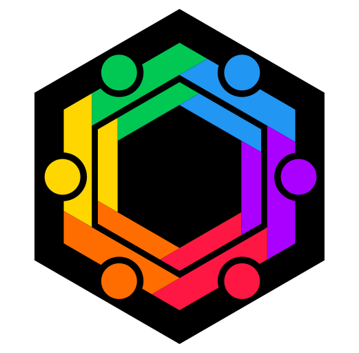

<link href="./assets/styles/markdown.css" rel="stylesheet"></link>
<link href="./assets/styles/color.css" rel="stylesheet"></link>
<link href="./assets/styles/grid.css" rel="stylesheet"></link>

<div><center></center></div>
<div><center></center></div>
<hr class="blue" style="height: 5px; margin-top: 0;">
<div class="blue-text" style="position:relative;text-align:right;">
  <span>
    initialis idea - ide awal
  </span><br>
  <span>
    in profectum - dalam progress
  </span><br>
  
  <span class="accent blue dark-4 white-text">
    dum finitur - sementara dinyatakan selesai
  </span>
</div>
<br><br><br>
<center>

# color.system.css
<span class="accent blue dark-4 white-text"><strong>Joko Wandyatmono - last updating Feb 17, 2023</strong></span>

#### /catalyst/02.development/00.paesan/app/docs/04.color.system.css.md
<hr class="blue" style="height: 5px; margin-bottom: 0;">
</center>
&nbsp;  

`color.system.css` dari `/raws` dimasukkan ke dalam project sebagaimana `grid.css` (sekarang `grid.layout.css`). Untuk mencobanya, home page (`/src/routes/+page.svelte`) semua isinya digantikan dengan `/raws/01.color.system/classes.trial.html`

`/src/app.html`

```html
<!DOCTYPE html>
<html lang="en">
	<head>
		<meta charset="utf-8" />
		<link rel="icon" type="image/png" sizes="32x32" href="%sveltekit.assets%/images/favicons/favicon-32.png" />
		<link rel="icon" type="image/png" sizes="96x96" href="%sveltekit.assets%/images/favicons/favicon-96.png" />
		<link rel="icon" type="image/png" sizes="128x128" href="%sveltekit.assets%/images/favicons/favicon-128.png" />
		<link rel="icon" type="image/png" sizes="180x180" href="%sveltekit.assets%/images/favicons/favicon-180.png" />
		<link rel="icon" type="image/png" sizes="192x192" href="%sveltekit.assets%/images/favicons/favicon-192.png" />
		<meta name="viewport" content="width=device-width, initial-scale=1.0">
		<link rel="stylesheet" type="text/css" href="%sveltekit.assets%/styles/grid.layout.css" />
		<link rel="stylesheet" type="text/css" href="%sveltekit.assets%/styles/color.system.css" />
		%sveltekit.head%
	</head>
	<body data-sveltekit-preload-data="hover">
		<div style="display: contents">%sveltekit.body%</div>
	</body>
</html>
```

`/src/routes/+page.svelte`

```html
<div class="row">
  <div class="col s6">
    <div class="sample light-membrane">
      membrane
    </div>
    <div class="sample light-membrane-1">
      membrane-1
    </div>
    <div class="sample light-membrane-2">
      membrane-2
    </div>
    <div class="sample light-membrane-3">
      membrane-3
    </div>
    <div class="sample light-membrane-4">
      membrane-4
    </div>
    <div class="sample light-nucleus">
      nuclues
    </div>
    <div class="sample light-nucleus-variant">
      nuclues-variant
    </div>
    <div class="sample light-cytoplasm">
      cytoplasm
    </div>
    <div class="sample light-cytoplasm-variant">
      cytoplasm-variant
    </div>
    <div class="sample light-cytoplasm-base">
      cytoplasm-base
    </div>
    <div class="sample light-cytoplasm-inner">
      cytoplasm-inner
    </div>
    <div class="sample light-cytoplasm-instrument">
      cytoplasm-instrument
    </div>
    <div class="sample light-cytoplasm-base-off">
      cytoplasm-base-off
    </div>
    <div class="sample light-cytoplasm-inner-off">
      cytoplasm-inner-off
    </div>
    <div class="sample light-cytoplasm-instrument-off">
      cytoplasm-instrument-off
    </div>
    <div class="sample light-cytoplasm-disabled">
      cytoplasm-disabled
    </div>
    <div class="sample light-cytoplasm-focus">
      cytoplasm-focus
    </div>
    <div class="sample light-cytoplasm-variant-focus">
      cytoplasm-variant-focus
    </div>
    <div class="sample light-cytoplasm-base-focus">
      cytoplasm-base-focus
    </div>
    <div class="sample light-cytoplasm-link" style="background-color:#b0bec5;">
      cytoplasm-link
    </div>
    <div class="sample light-cytoplasm-visited" style="background-color:#b0bec5;">
      cytoplasm-visited
    </div>
    <div class="sample light-cytoplasm-hover" style="background-color:#b0bec5;">
      cytoplasm-hover
    </div>
    <div class="sample light-cytoplasm-active" style="background-color:#b0bec5;">
      cytoplasm-active
    </div>
    <div class="sample light-error">
      error
    </div>
    <div class="row">
      <div class="col s6">
        <div class="sample red">
          <div class="black-text" style="display:flex;">
            red
            <div class="white-text" style="margin-left:auto;">red</div>
          </div>
        </div>
      </div>
      <div class="col s6">
        <div class="sample light-membrane red-text">red-text</div>
      </div>
    </div>
    <div class="row">
      <div class="col s6">
        <div class="sample orange">
          <div class="black-text" style="display:flex;">
            orange
            <div class="white-text" style="margin-left:auto;">orange</div>
          </div>
        </div>
      </div>
      <div class="col s6">
        <div class="sample light-membrane orange-text">orange-text</div>
      </div>
    </div>
    <div class="row">
      <div class="col s6">
        <div class="sample yellow">
          <div class="black-text" style="display:flex;">
            yellow
            <div class="white-text" style="margin-left:auto;">yellow</div>
          </div>
        </div>
      </div>
      <div class="col s6">
        <div class="sample light-membrane yellow-text">yellow-text</div>
      </div>
    </div>
    <div class="row">
      <div class="col s6">
        <div class="sample green">
          <div class="black-text" style="display:flex;">
            green
            <div class="white-text" style="margin-left:auto;">green</div>
          </div>
        </div>
      </div>
      <div class="col s6">
        <div class="sample light-membrane green-text">green-text</div>
      </div>
    </div>
    <div class="row">
      <div class="col s6">
        <div class="sample blue">
          <div class="black-text" style="display:flex;">
            blue
            <div class="white-text" style="margin-left:auto;">blue</div>
          </div>
        </div>
      </div>
      <div class="col s6">
        <div class="sample light-membrane blue-text">blue-text</div>
      </div>
    </div>
    <div class="row">
      <div class="col s6">
        <div class="sample indigo">
          <div class="black-text" style="display:flex;">
            indigo
            <div class="white-text" style="margin-left:auto;">indigo</div>
          </div>
        </div>
      </div>
      <div class="col s6">
        <div class="sample light-membrane indigo-text">indigo-text</div>
      </div>
    </div>
    <div class="row">
      <div class="col s6">
        <div class="sample purple">
          <div class="black-text" style="display:flex;">
            purple
            <div class="white-text" style="margin-left:auto;">purple</div>
          </div>
        </div>
      </div>
      <div class="col s6">
        <div class="sample light-membrane purple-text">purple-text</div>
      </div>
    </div>
  </div>
  <div class="col s6">
    <div class="sample dark-membrane">
      membrane
    </div>
    <div class="sample dark-membrane-1">
      membrane-1
    </div>
    <div class="sample dark-membrane-2">
      membrane-2
    </div>
    <div class="sample dark-membrane-3">
      membrane-3
    </div>
    <div class="sample dark-membrane-4">
      membrane-4
    </div>
    <div class="sample light-nucleus">
      nuclues
    </div>
    <div class="sample dark-nucleus-variant">
      nuclues-variant
    </div>
    <div class="sample dark-cytoplasm">
      cytoplasm
    </div>
    <div class="sample dark-cytoplasm-variant">
      cytoplasm-variant
    </div>
    <div class="sample dark-cytoplasm-base">
      cytoplasm-base
    </div>
    <div class="sample dark-cytoplasm-inner">
      cytoplasm-inner
    </div>
    <div class="sample dark-cytoplasm-instrument">
      cytoplasm-instrument
    </div>
    <div class="sample dark-cytoplasm-base-off">
      cytoplasm-base-off
    </div>
    <div class="sample dark-cytoplasm-inner-off">
      cytoplasm-inner-off
    </div>
    <div class="sample dark-cytoplasm-instrument-off">
      cytoplasm-instrument-off
    </div>
    <div class="sample dark-cytoplasm-disabled">
      cytoplasm-disabled
    </div>
    <div class="sample dark-cytoplasm-focus">
      cytoplasm-focus
    </div>
    <div class="sample dark-cytoplasm-variant-focus">
      cytoplasm-variant-focus
    </div>
    <div class="sample dark-cytoplasm-base-focus">
      cytoplasm-base-focus
    </div>
    <div class="sample dark-cytoplasm-link" style="background-color:#455a64;">
      cytoplasm-link
    </div>
    <div class="sample dark-cytoplasm-visited" style="background-color:#455a64;">
      cytoplasm-visited
    </div>
    <div class="sample dark-cytoplasm-hover" style="background-color:#455a64;">
      cytoplasm-hover
    </div>
    <div class="sample dark-cytoplasm-active" style="background-color:#455a64;">
      cytoplasm-active
    </div>
    <div class="sample dark-error">
      error
    </div>
    <div class="row">
      <div class="col s6">
        <div class="sample red">
          <div class="black-text" style="display:flex;">
            red
            <div class="white-text" style="margin-left:auto;">red</div>
          </div>
        </div>
      </div>
      <div class="col s6">
        <div class="sample dark-membrane red-text">red-text</div>
      </div>
    </div>
    <div class="row">
      <div class="col s6">
        <div class="sample orange">
          <div class="black-text" style="display:flex;">
            orange
            <div class="white-text" style="margin-left:auto;">orange</div>
          </div>
        </div>
      </div>
      <div class="col s6">
        <div class="sample dark-membrane orange-text">orange-text</div>
      </div>
    </div>
    <div class="row">
      <div class="col s6">
        <div class="sample yellow">
          <div class="black-text" style="display:flex;">
            yellow
            <div class="white-text" style="margin-left:auto;">yellow</div>
          </div>
        </div>
      </div>
      <div class="col s6">
        <div class="sample dark-membrane yellow-text">yellow-text</div>
      </div>
    </div>
    <div class="row">
      <div class="col s6">
        <div class="sample green">
          <div class="black-text" style="display:flex;">
            green
            <div class="white-text" style="margin-left:auto;">green</div>
          </div>
        </div>
      </div>
      <div class="col s6">
        <div class="sample dark-membrane green-text">green-text</div>
      </div>
    </div>
    <div class="row">
      <div class="col s6">
        <div class="sample blue">
          <div class="black-text" style="display:flex;">
            blue
            <div class="white-text" style="margin-left:auto;">blue</div>
          </div>
        </div>
      </div>
      <div class="col s6">
        <div class="sample dark-membrane blue-text">blue-text</div>
      </div>
    </div>
    <div class="row">
      <div class="col s6">
        <div class="sample indigo">
          <div class="black-text" style="display:flex;">
            indigo
            <div class="white-text" style="margin-left:auto;">indigo</div>
          </div>
        </div>
      </div>
      <div class="col s6">
        <div class="sample dark-membrane indigo-text">indigo-text</div>
      </div>
    </div>
    <div class="row">
      <div class="col s6">
        <div class="sample purple">
          <div class="black-text" style="display:flex;">
            purple
            <div class="white-text" style="margin-left:auto;">purple</div>
          </div>
        </div>
      </div>
      <div class="col s6">
        <div class="sample dark-membrane purple-text">purple-text</div>
      </div>
    </div>
  </div>
  <div class="col s12">
    <div class="sample light-membrane-4">
      <div class="black-text" style='display:flex;'>
        black-text
        <div class="white-text" style='margin-left: auto;'>
          white-text
        </div>
      </div>
    </div>
  </div>
</div>
```

<div style="text-align: center">
  <br>
  <span type="font-size: 0.8px;">
    Sebagian tampilan colors
  </span><br><br>
</div>

<hr class="blue" style="height: 5px; margin-bottom: 0;">
<div class="footer blue-text">
  <div style="text-align: center; padding-top: 5px;"><strong>The <span style="font-size: 1.5em;">A</span> Taskforce</strong></div>
  <div class="footer-inner">
    <div class="avatar inline L">
      <svg 
          xmlns="http://www.w3.org/2000/svg" 
          xmlns:xlink="http://www.w3.org/1999/xlink" 
          x="0px" y="0px" width="100%" height="100%"
          position="absolute" top="0px" left="0px"
          viewBox="87.5 87.5 65 73"
          xml:space="preserve"
      >
          <defs>
              <pattern id="profile-0" height="100%" width="100%" patternContentUnits="objectBoundingBox" viewBox="0 0 1 1" preserveAspectRatio="xMidYMid slice">
                <image height="1" width="1"  preserveAspectRatio="xMidYMid slice" xlink:href="../../../../assets/images/profiles/dani.agus.sulistyanto.avif" />
              </pattern> 
          </defs>
          <path fill="url(#profile-0)" d="M122.6,159.883c-1.431,0.822-3.77,0.822-5.201,0l-27.298-15.701c-1.431-0.822-2.601-2.84-2.601-4.483v-31.397 c0-1.647,1.17-3.662,2.601-4.484l27.298-15.7c1.431-0.823,3.77-0.823,5.201,0l27.301,15.7c1.431,0.822,2.6,2.837,2.6,4.484v31.397 c0,1.644-1.169,3.661-2.6,4.483L122.6,159.883z"/>
          <path fill="transparent" stroke="white" stroke-width=".75" d="M146.38,105.483l-23.467-13.498c-0.785-0.452-1.819-0.7-2.912-0.7c-1.094,0-2.128,0.249-2.911,0.7 L93.62,105.483c-1.605,0.922-2.911,3.173-2.911,5.018v26.99c0,1.847,1.306,4.1,2.91,5.024l23.472,13.5 c0.784,0.45,1.817,0.699,2.909,0.699c1.091,0,2.125-0.249,2.913-0.699l23.468-13.5c1.605-0.927,2.912-3.18,2.912-5.024v-26.99 C149.293,108.658,147.985,106.406,146.38,105.483z"/>
      </svg>
    </div>
    <div class="avatar inline L">
      <svg 
          x="0px" y="0px" width="100%" height="100%"
          position="absolute" top="0px" left="0px"
          viewBox="87.5 87.5 65 73"
          xml:space="preserve"
      >
          <defs>
              <pattern id="profile-1" height="100%" width="100%" patternContentUnits="objectBoundingBox" viewBox="0 0 1 1" preserveAspectRatio="xMidYMid slice">
                <image height="1" width="1"  preserveAspectRatio="xMidYMid slice" xlink:href="../../../../assets/images/profiles/emond.suwandi.avif" />
              </pattern> 
          </defs>
          <path fill="url(#profile-1)" d="M122.6,159.883c-1.431,0.822-3.77,0.822-5.201,0l-27.298-15.701c-1.431-0.822-2.601-2.84-2.601-4.483v-31.397 c0-1.647,1.17-3.662,2.601-4.484l27.298-15.7c1.431-0.823,3.77-0.823,5.201,0l27.301,15.7c1.431,0.822,2.6,2.837,2.6,4.484v31.397 c0,1.644-1.169,3.661-2.6,4.483L122.6,159.883z"/>
          <path fill="transparent" stroke="white" stroke-width=".75" d="M146.38,105.483l-23.467-13.498c-0.785-0.452-1.819-0.7-2.912-0.7c-1.094,0-2.128,0.249-2.911,0.7 L93.62,105.483c-1.605,0.922-2.911,3.173-2.911,5.018v26.99c0,1.847,1.306,4.1,2.91,5.024l23.472,13.5 c0.784,0.45,1.817,0.699,2.909,0.699c1.091,0,2.125-0.249,2.913-0.699l23.468-13.5c1.605-0.927,2.912-3.18,2.912-5.024v-26.99 C149.293,108.658,147.985,106.406,146.38,105.483z"/>
      </svg>
    </div>
    <div class="avatar inline L">
      <svg 
          x="0px" y="0px" width="100%" height="100%"
          position="absolute" top="0px" left="0px"
          viewBox="87.5 87.5 65 73"
          xml:space="preserve"
      >
          <defs>
              <pattern id="profile-2" height="100%" width="100%" patternContentUnits="objectBoundingBox" viewBox="0 0 1 1" preserveAspectRatio="xMidYMid slice">
                <image height="1" width="1"  preserveAspectRatio="xMidYMid slice" xlink:href="../../../../assets/images/profiles/annisa.jodiyosa.avif" />
              </pattern> 
          </defs>
          <path fill="url(#profile-2)" d="M122.6,159.883c-1.431,0.822-3.77,0.822-5.201,0l-27.298-15.701c-1.431-0.822-2.601-2.84-2.601-4.483v-31.397 c0-1.647,1.17-3.662,2.601-4.484l27.298-15.7c1.431-0.823,3.77-0.823,5.201,0l27.301,15.7c1.431,0.822,2.6,2.837,2.6,4.484v31.397 c0,1.644-1.169,3.661-2.6,4.483L122.6,159.883z"/>
          <path fill="transparent" stroke="white" stroke-width=".75" d="M146.38,105.483l-23.467-13.498c-0.785-0.452-1.819-0.7-2.912-0.7c-1.094,0-2.128,0.249-2.911,0.7 L93.62,105.483c-1.605,0.922-2.911,3.173-2.911,5.018v26.99c0,1.847,1.306,4.1,2.91,5.024l23.472,13.5 c0.784,0.45,1.817,0.699,2.909,0.699c1.091,0,2.125-0.249,2.913-0.699l23.468-13.5c1.605-0.927,2.912-3.18,2.912-5.024v-26.99 C149.293,108.658,147.985,106.406,146.38,105.483z"/>
      </svg>
    </div>
  </div>
  <div style="margin-top: 72px; text-align: center; font-size: 0.9em">
    <strong>HEKSAGON BERSATU</strong>
  </div>
  <div style="text-align: center; font-size: 0.8em; margin-top: -5px;">Enterprise Software Couturier</div>
</div>
